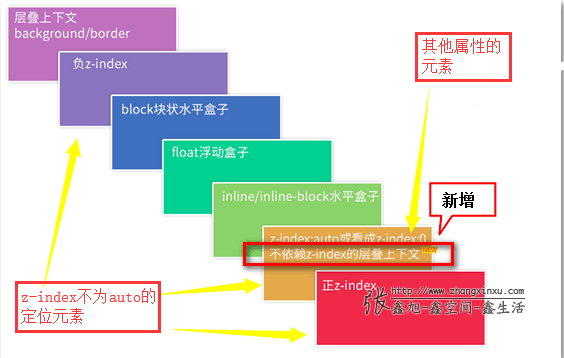
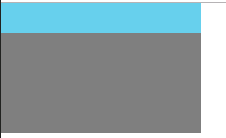
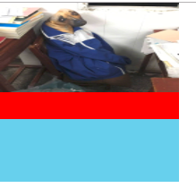
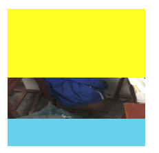
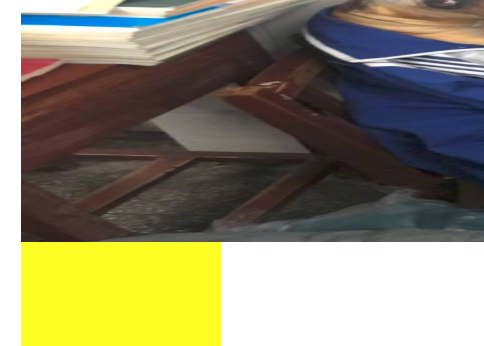
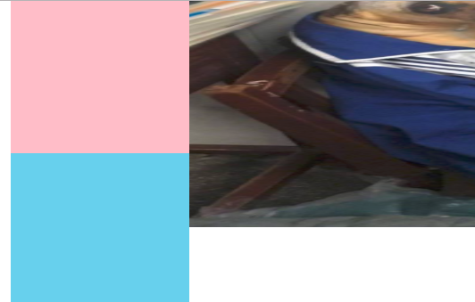
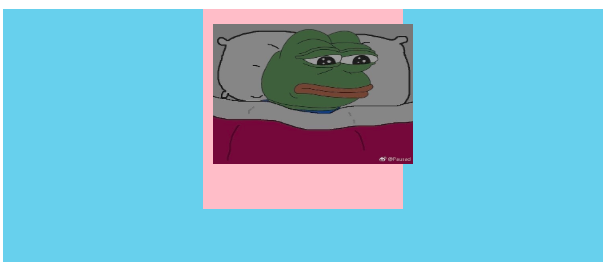

## 前言
>本篇文章参考张鑫旭老师的[深入理解CSS中的层叠上下文和层叠顺序](https://www.zhangxinxu.com/wordpress/2016/01/understand-css-stacking-context-order-z-index/)
     
## 一：什么是层叠上下文？
层叠上下文可以理解为三维中的Z轴，如下图所示：


## 二：什么是层叠水平？
表示Z轴的远近，层叠水平越高，距离用户越近。所有元素都有层叠水平，即先来后到，否则就乱了。不管普通元素还是层叠上下文元素都按照层叠顺序来显示。

## 三：什么是层叠顺序？
同一层叠上下文中，元素垂直显示的顺序。如下图：


同一层叠顺序的层叠上下文元素，可以通过z-index来影响层叠水平。z-index只对 position   
不为static的定位元素起效果，对于普通元素(没定位)不起效果。       

## 四：层叠上下文的特点？    

层叠上下文元素的特点：    
1.层叠上下文的层叠水平要比普通元素高    
2.层叠上下文可以嵌套，内部层叠上下文及其所有子元素均受制于外部的层叠上下文     
3.层叠上下文元素的后代都受其影响。 
4.每个层叠上下文是自成体系的，当元素发生层叠的时候，整个元素被认为是在父层叠上   下文的层叠顺序中。   
5.同一层叠上下文，指的是以最近的祖先层叠上下文元素为基准的层叠上下文。    
6.同一层叠上下文中，为基准的层叠上下文元素相当于background层(最底层)    

  比如：       
```
<div class="box"> // block层
   <div class="inner" style="position: absolute; z-index: 2"></div> // z-index正值层，也就是最高层
</div> 
```

在以html(层叠上下文元素)为基准的层叠上下文中，block层 < z-index正值层
  
```
<div class="box" style="transform: scale(1)"> // 基准的层叠上下文元素
      <div class="inner" style="position: absolute; z-index: 2"></div>
</div>   
```

.box的后代元素都处在以.box为基准的同一层叠上下文中。      
.box又处在以html为基准的同一层叠上下文中。     
对应特点的第2点
   

## 五：层叠上下文的创建
- html根元素具有层叠上下文：   
  根层叠上下文，这就是为什么，position：absolute的元素在left/top定位的时候，以根元素相对定位
  
- z-index：数值:     
  当position不为static，且z-index不为auto时候，就会创建新的层叠上下文。
  如果position不为static，z-index:auto的话，会被默认为普通的div元素
  
- css3属性之flex    
  1.父元素flex/inline-flex    
  2.子元素z-index不为auto    
  
  满足以上两个条件，才会在**子元素**上创建新的层叠上下文，新的层叠上下文处于层叠顺序的最底层，   
  也就是**background层**。
  
- 其他的css3属性，比如：   
  1.元素的opacity值不是1.    
  2.元素的transform值不是none.   
  3.元素mix-blend-mode值不是normal.   
  4.元素的filter值不是none.   
  5.元素的isolation值是isolate.   
  6.will-change指定的属性值为上面任意一个。   
  7.元素的-webkit-overflow-scrolling设为touch.   
  
 **什么才是层叠上下文元素？**     

 创建了层叠上下文的元素，就是层叠上下文元素。比如以上创建的z-index不为auto的定位元素，一些css3元素等都是层叠上下文元素，然而一些 float, inline-block都是普通的元素。    
 层叠上下文元素就是当官的，普通元素就是老百姓，当官比百姓厉害。   
 层叠上下文元素在 层叠上下文中所处的**位置**，如下图所示：

 

- **需要注意的是**：z-index:0的定位元素是层叠上下文元素，z-index: auto 或者没有z-index的定位元素只是**普通元素**，但是却和其他属性创建的层叠上下文元素处在同一层叠顺序。按照后来者居上。        
例如：    
```
<div class="box" style="transform: scale(1);  background: skyblue;"></div>      
<div class="follows" style=" position: relative; background: gray;"></div> 
```


内部层叠上下文元素的重叠都受 外部层叠上下文制约，在外部层叠上下文中，即以根元素html为基准，scale创建的层叠上下文元素和z-index：auto的定位元素在同一层叠顺序，按照后来者居上。(ps：没有z-index属性 就等于 z-index: auto)

<br>
## 六：务必牢记的层叠准则：
 - 谁大谁上：
   处在同一层叠上下文中，有z-index的标注的时候，谁大谁上，官大压死官小的。
   
 - 后来居上：
   处在同一层叠上下文中，同一层叠顺序，同一层叠水平，后来者居上。

<br>
## 七：以不同元素为基准的层叠上下文   
<br>
### 以html元素(根元素)为基准的层叠上下文
<br>
#### 实例一：

```
<div class="box" style="position: relative;"> // 没有z-index,相当于 z-index: auto,处在 auto层
    // 层叠上下文元素，z-index正值，最高层
    </div>
<div class="box" style="position: relative; " >// 没有z-index,相当于 z-index: auto,处在 auto层
    // 层叠上下文元素，z-index正值，最高层
</div>
```


在以html为基准的同一层叠上下文中， 根据黄金层叠准则，**谁大谁上**。 

<br>
#### 实例二：

```
    <div class="box" style="background: skyblue;">
       // inline-block
    </div>
    <div class="box" style="background: red; float: left; " >
    </div>
    
```
 
 
 
 在以html为基准的同一层叠上下文中，根据**层叠顺序规则**，block < float < inline-block 层

<br>
#### 实例三：

           
```
    <div class="box" style="background: yellow; z-index: 4">
       
    </div>
```
    
 
 
 在以html为基准的同一层叠上下文中，根据**层叠顺序规则**，z-index负值 < block 层, 如下图所示：       

 
 
<br> 
#### 实例四：
  
  ```
    <div class="box" style="position: relative; z-index: 0">
      
    </div>
   
     <div class="box" style="position: relative; z-index: 0">
      
    </div>
  ```
  
   

 在以html为基准的同一层叠上下文中， 根据黄金层叠准则，**后来者居上**。      
 并且层叠上下文元素的后代都受其影响。(即图片5压着图片4，即使z-index小)   
 相当于管家之间的争斗没用，要看主子之间的争斗。
 
 <br>
### 以新层叠上下文元素为基准的层叠上下文

<br>  
#### 实例五：
   
```
<div class="box" style="position: relative; z-index: 0"> // 产生了新的层叠上下文，成层叠上下文元素, 为基准，相当于background层
   // z-index负值层
</div>
```
   
   
 
 以.box为基准的同一层叠上下文中，为基准的层叠上下文元素相当于background层(最底层), 根据**层叠顺序规则**，  <br> background < z-index负值    

<br>   
#### 实例六：   

```
<div class="box" style="transform: rotate(0deg); background: skyblue;"> // 基准的层叠上下文相当于 background层
  <div class="inner" style="background: yellow;"></div> // block层
   // z-index负值层
</div>  
```

    
  
以.box为基准的同一层叠上下文中，为基准的层叠上下文元素相当于background层(最底层), 根据**层叠顺序规则**，<br> background < z-index负值 < block层

<br>  
### 实例七：

```
   <div class="box" style="display: flex;"> 
      <div class="inner" style="background: yellow; z-index: 1"> // 基准的层叠上下文相当于 background层
            // z-index负值
      </div>
    </div>   
```
  
   
  
  flex的子元素 z-index不为auto的话，就产生了新的层叠上下文，以flex的子项为基准的同一层叠上下文中，根据**层叠顺序规则**，background < z-index负值层
  
<br>  
#### 实例八：
  
```
   <div class="box" style="display: flex; background: skyblue;">
      <div class="inner" style="background: pink; "> // z-index为auto， 普通div元素
           // z-index负值层
      </div>
    </div>    
```
  
    
  
  flex的子项如果z-index为auto，就是普通元素，那么以上一个层叠上下文元素为基准，即以html为基准同一层叠上下文中，z-index负值 < block层

<br>
## 总结  

  - 创建了层叠上下文的元素就是 层叠上下文元素。
  - 同一层叠上下文，指的是以最近的祖先层叠上下文元素为基准的层叠上下文。
  - 同一层叠上下文中，同一层叠顺序的，按照 黄金准则，不同顺序，按照 层叠顺序规则。

## 拓展

在css3以下，position:absolute元素是基于position不为static的祖先元素来left/top等定位的。    
但在无意中发现，position:absolute元素也可以基于一些css3属性创建的层叠上下文元素来left/top定位。
     
例如：
```
<div class="main" style="position: relative; background: skyblue;">
    <div class="box" style=" transform: scale(1); background: pink;">
       
    </div>
</div>
```
   
     

absolute的元素并没有相对于relative定位，而是相对于transform属性的元素来定位，transform元素表现出relative的特性。   
经过测试；      

- 当祖先元素有transform、filter不为opacity,none，will-change属性的时候，子元素absolute是相对于他们定位，ie9+/chrome/firfox 都支持。    
- 当祖先元素有transform、filter不为opacity,none，will-change属性的时候，子元素 fixed是相对于他们定位，chrome/firfox支持，ie不支持，ie还是相对html定位。

